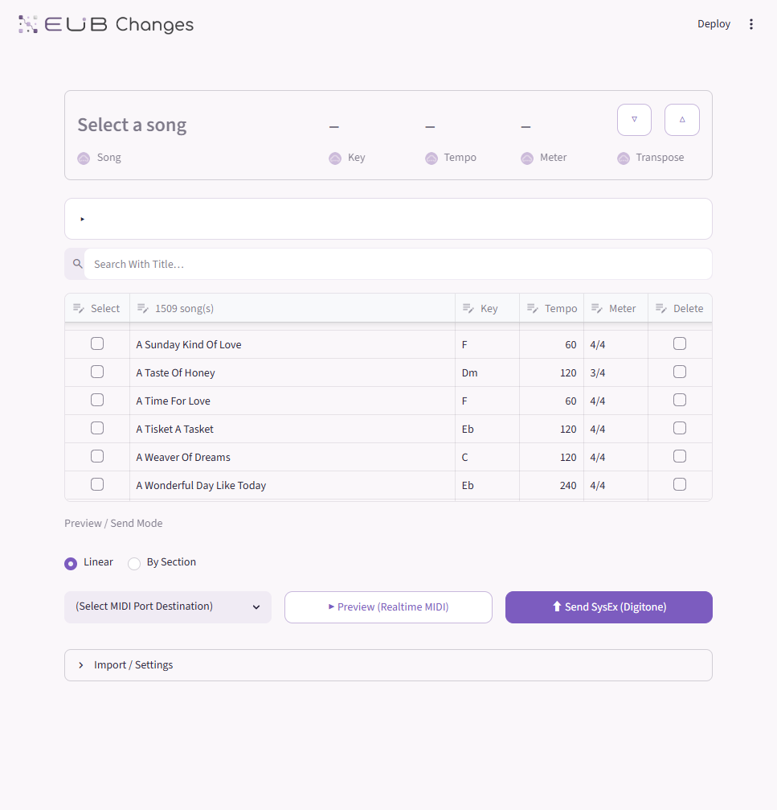
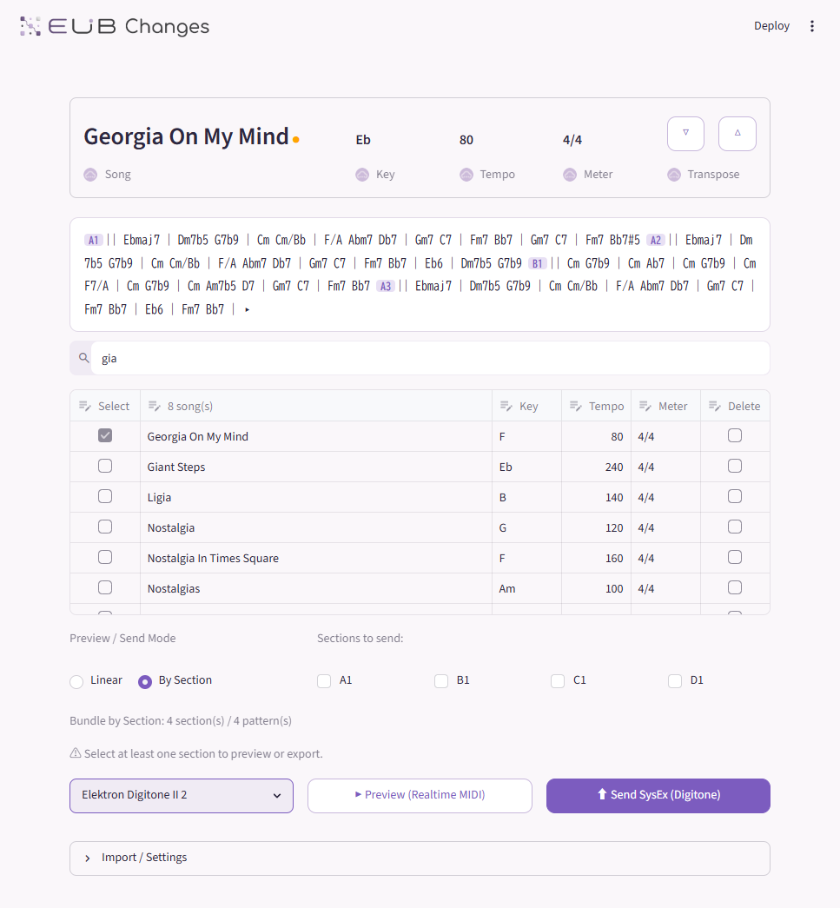

# EUB Changes (EUB-SW01)


**EUB Changes is a Windows desktop app for Digitone II machine-live performance.**  
It turns MusicXML chord charts into playable Cloud, Bass, and Chord patterns for Digitone II.




## Download

Available as a Windows executable. No Python, pip, or command-line setup required.

→ Releases: TBA

## What it does

EUB Changes generates Digitone II performance material from MusicXML chord charts:

| Layer | Default Tracks | Role |
| --- | --- | --- |
| Cloud | Track 1–6 | Six-voice moving harmony texture |
| Bass | Track 7 | Low-register grounding layer |
| Chord | Track 8 | Symbol-faithful vertical harmony |

Tracks 9–16 remain available for your own arrangement and live performance material.

## Workflow

1. Export a MusicXML chord chart from iReal Pro or another source
2. Open EUB Changes and import the file
3. Select a song from the Song Library
4. Optionally transpose to your performance key
5. Configure Layer Options (track routing, voice range, trigger policy)
6. Choose a Send Mode: **Linear** or **Bundle by Section**
7. Confirm with Realtime MIDI Preview
8. Send SysEx to Digitone II

## Features

- **Song Library** — import, search, select, and manage songs
- **Chord Cells** — view chord progression layout by section
- **Cloud Voice Leading Graph** — visualize 6-voice movement across the song
- **Section Filter** — target only selected sections
- **Transpose** — shift the song to your performance key
- **Realtime MIDI Preview** — hear generated harmony before sending
- **Linear send** — minimal patterns, continuous arrangement
- **Bundle by Section** — one pattern per section, Song Mode–ready
- **Pattern Change** — automatic Song Mode pattern transition settings

## Safety

- Preview does not write to hardware
- Hardware write confirmation is enabled by default
- No MIDI port is auto-selected
- Send SysEx requires explicit port selection

**Recommended first use:** use an empty Digitone II Project or back up your patterns before sending.

## Development

To run the UI without building the desktop app:

```powershell
python -m pip install -e ".[ui,sysex]"
python -m streamlit run src/changes/main_ui.py
```

To build the Windows desktop executable:

```powershell
scripts\BuildDesktop.ps1
```

See [`docs/`](docs/) for architecture, implementation notes, and CLI reference.

Sorry, developer docs are written in only Japanse.

## License

EUB Changes is released under the MIT License.  
See [LICENSE](./LICENSE) for details.
