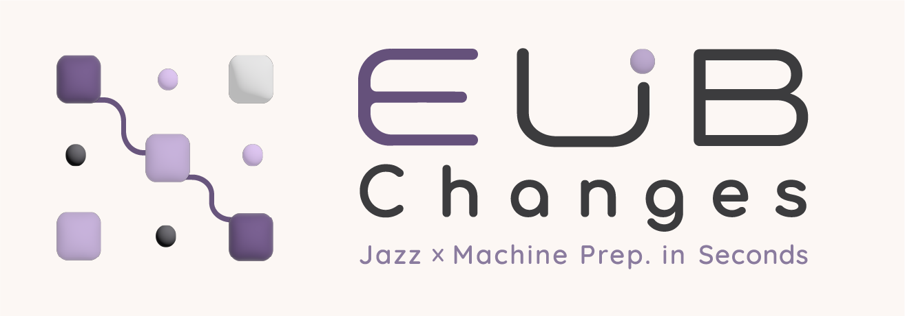
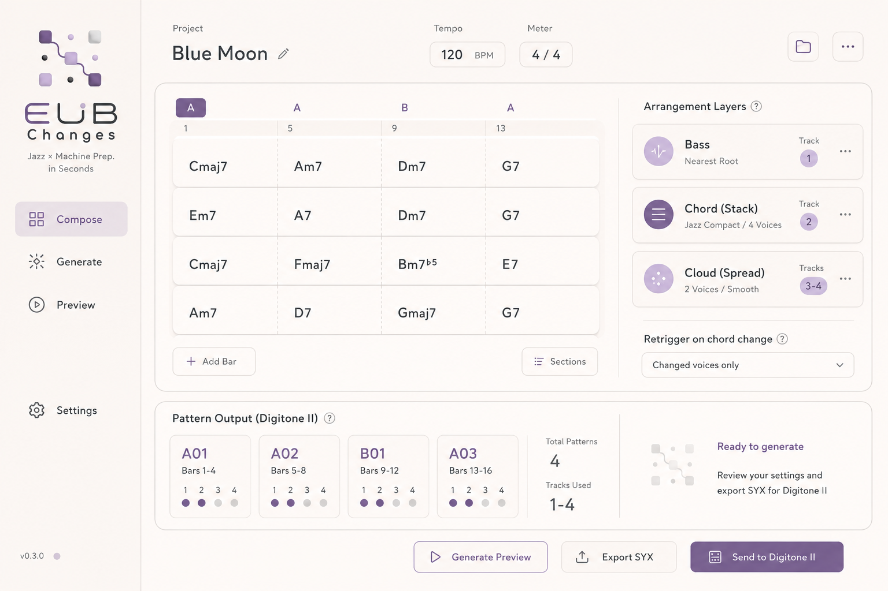

# EUB Changes



**Your little guide for jazz changes.
Turn chord progressions into voice-led harmonic layers for Digitone II — ready to mute, hold, reshape, and play.**

This repository contains a **machine‑jazz harmony engine** for generating six‑voice jazz chord clouds.
It provides generic MIDI output and prepares Digitone II output through a Native SysEx backend.

The core concept is to:

- Parse jazz chord progressions (including MusicXML converted from the iRealPro app and MusicXML converted via `ireal-musicxml`).  
- Expand each chord into a six‑note voicing such as a 6/9, 9, 13, sus or altered variant with added tensions.  
- Voice‑lead between chords with minimal melodic motion.  
- Export Generic MIDI file or send Generic realtime MIDI for DAW/soft-synth/hardware checks.
- Build Digitone II Pattern SysEx from toolkit-compatible `.events.yaml` via `digitone-syx-toolkit`.

This project prioritizes deterministic behavior, readable music‑theory logic, and performance‑safe MIDI output. It is intended to be used in Emnyeca/EMN Records machine‑jazz sessions and Embient events, but the code may be adapted for other live harmony generation setups.



## Musical Output Change Notice

- Older builds expanded each chord symbol independently with fixed mappings (for example m7 -> m6/9).
- Current builds derive harmonic content from progression context (Local Pitch Collection -> Selected Scale Collection -> six output slots).
- Therefore, regenerated MIDI and Digitone patterns can differ in note content from older artifacts.
- Generic MIDI and Digitone Native SysEx exports now share the same context-aware harmonic content.

## Backend Policy

- Primary Digitone path: Native SysEx backend (`digitone-syx-toolkit` dependency).
- Generic MIDI backend: kept as first-class output path.
- Legacy high-speed Digitone realtime recording workflow: moved out of normal product flow.

Contributions and issue reports are welcome once the basic architecture is in place.

## Minimal Streamlit UI (drag & drop)

You can run a simple GUI for non-terminal workflows:

1. Install dependencies:

	- `pip install -e ../digitone-syx-toolkit`
	- `pip install -e .[ui,realtime,test]`

2. Launch app:

	- `python -m streamlit run src/changes/ui_streamlit.py`

The UI supports:

- Drag & drop YAML progression
- Tempo / meter input
- Hold Trigger ON/OFF switch (same-pitch retrigger policy)
- Per-track MIDI channel assignment (Track1-6 + Bass, each `send off` or 1-16)
- Independent Bass track (C1-B1), with root/fifth auto-switch after configurable repeats
- MIDI file generation
- Realtime send to selected MIDI output port
- Digitone compile pipeline export:
	- `song_model.json`
	- `rendered_timeline.json`
	- `digitone_compile_plan.json`
	- `digitone.events.yaml`
	- optional `digitone_pattern.syx`

Artifact format policy:

- `*.json`: audit-friendly intermediate models (Fraction values serialized as strings)
- `digitone.events.yaml`: toolkit validation schema (`version`, `device`, `name`, `pattern`, `events`)
- `digitone_pattern.syx`: generated through path-based toolkit API using saved `digitone.events.yaml`

## CLI Usage

Generic MIDI (existing flow):

```bash
changes examples/waltz.yaml --output out.mid --tempo 120
```

Digitone compile pipeline (Phase 4+):

```bash
changes examples/waltz.yaml --backend digitone-compile --artifact-dir out_digitone
```

With SYX generation through toolkit:

```bash
changes examples/waltz.yaml --backend digitone-compile --artifact-dir out_digitone --write-syx
```

Digitone-specific Native SysEx backend design notes:

- `docs/design/digitone-native-syx-backend.md`

Toolkit wrapper (events.yaml -> syx):

```python
from changes.digitone_backend import build_digitone_syx_from_events_yaml

build_digitone_syx_from_events_yaml(
	"../digitone-syx-toolkit/captures/generated/events/trial1_minimal_trigger.events.yaml",
	"out/trial1.syx",
)
```

Toolkit package dependency is currently expected via local editable install.
Pinning by tag/SHA can be introduced after API stabilization.

Tempo separation for Native SysEx planning:

- `performance_tempo`: musical tempo used by performer/DAW context
- `digitone_device_tempo`: tempo configured on Digitone for SPEED=`1/8`

Formula:

- General form: `digitone_device_tempo = performance_tempo / (4 * speed_ratio * q_step)`
- SPEED=`1/8` special case: `digitone_device_tempo = 2 * performance_tempo / q_step`

For realtime send, also install:

- `pip install -e .[realtime]`
